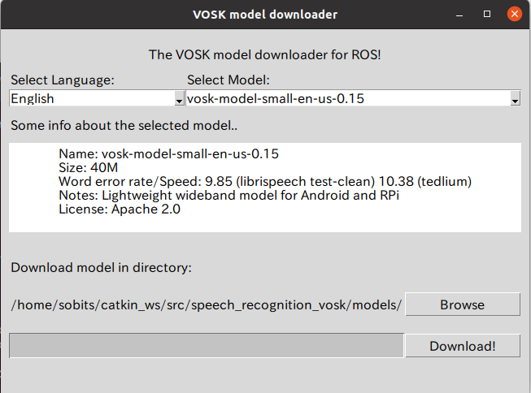

<a name="readme-top"></a>

[JA](README.md) | [EN](README.en.md)

[![Contributors][contributors-shield]][contributors-url]
[![Forks][forks-shield]][forks-url]
[![Stargazers][stars-shield]][stars-url]
[![Issues][issues-shield]][issues-url]
[![License][license-shield]][license-url]

ROS VOSK
======================
<!--  TABLE OF CONTENTS -->
<details>
  <summary>目次</summary>
  <ol>
    <li>
      <a href="#introduction">概要</a>
    </li>
    <li>
      <a href="#環境構築">環境構築</a>
      <ul>
        <li><a href="#環境条件">環境条件</a></li>
        <li><a href="#installation">インストール方法</a></li>
      </ul>
    </li>
    <li>
    <a href="#launch">Launch</a>
    </li>
    <li>
    <a href="#Service Name">Service名</a>
    </li>
    <li><a href="#milestone">マイルストーン</a></li>
    <li><a href="#Main Authors">Main Authors</a></li>
    <!-- <li><a href="#contributing">Contributing</a></li> -->
    <!-- <li><a href="#license">License</a></li> -->

  </ol>
</details>


## 概要
これは、[Vosk](https://github.com/alphacep/vosk-api)と[ros_vosk](https://github.com/alphacep/ros-vosk)に基づく音声テキストサービス用のROSパッケージになります。

<!-- セットアップ -->
## セットアップ

ここで，本レポジトリのセットアップ方法について説明します．

<p align="right">(<a href="#readme-top">上に戻る</a>)</p>


### 環境条件

まず，以下の環境を整えてから，次のインストール段階に進んでください．

| System  | Version |
| ------------- | ------------- |
| Ubuntu | 20.04 (Focal Fossa) |
| ROS | Noetic Ninjemys |
| Python | 3.8 |

> [!NOTE]
> `Ubuntu`や`ROS`のインストール方法に関しては，[SOBITS Manual](https://github.com/TeamSOBITS/sobits_manual#%E9%96%8B%E7%99%BA%E7%92%B0%E5%A2%83%E3%81%AB%E3%81%A4%E3%81%84%E3%81%A6)に参照してください．

<p align="right">(<a href="#readme-top">上に戻る</a>)</p>


### インストール方法

1. ROSの`src`フォルダに移動します．
   ```sh
   $ roscd
   # もしくは，"cd ~/catkin_ws/"へ移動．
   $ cd src/
   ```
2. 本レポジトリをcloneします．
   ```sh
   $ git clone https://github.com/TeamSOBITS/ros_vosk
   ```
3. レポジトリの中へ移動します．
   ```sh
   $ cd ros_vosk/
   ```
4. 依存パッケージをインストールします．
   ```sh
   $ bash install.sh
   ```
5. パッケージをコンパイルします．
   ```sh
   $ roscd
   # もしくは，"cd ~/catkin_ws/"へ移動．
   $ catkin_make
   ```

<p align="right">(<a href="#readme-top">上に戻る</a>)</p>


> **Warning**
> 新しい生成された msg が認識されず、`import error` が表示されることがあります。そのような場合は、新しいターミナルを開くか、コンテナを再起動する必要があります（Dockerを使用している場合）


## Launch

1. 使用したいモデルがコンフィグファイルで正しく選択されていることを確認してください。
```bash
cat ~/catkin_ws/src/ros_vosk/cfg/params.yaml
# cat ~/catkin_ws/src/speech_recognition_vosk/cfg/params.yaml
```

> **Note**
> [list of models compatible with Vosk-API](https://alphacephei.com/vosk/models).の言語モデルを使用できることを忘れないでください。

> **Note**
> モデルがデータベースに存在すれば、自動的にダウンロードされるはずです。

2. Launch the node

```bash
# Launch the speech recognition node
roslaunch ros_vosk ros_vosk.launch

# if you want to select language
# English ver
roslaunch ros_vosk ros_vosk.launch lang=en
# Japanese ver
roslaunch ros_vosk ros_vosk.launch lang=ja

# or by running
rosrun ros_vosk vosk_node.py
# rosrun speech_recognition_vosk vosk_node.py
```
3. 初めてlaunchを使用する場合

最初の実行では、モデルをダウンロードするために以下のような画面が表示されます。
  
英語を使用する場合は「Select language」で「English」を、「Select model」で「vosk-model-ja-0.15」を選択してダウンロードしてください。

日本語を使用する場合は、「言語の選択」で「日本語」を選択し、「モデルの選択」で「vosk-model-ja-0.22」を選択してダウンロードしてください。

## Service名
```
/speech_recognition  #same web_speech_recognition
```


## インターフェース

### Publishing Topics
- speech_recognition/vosk_result    -> vosk_node.py publishes a custom "speech_recognition" message
- speech_recognition/final_result   -> vosk_node.py publishes a simple string with the final result
- speech_recognition/partial_result -> vosk_node.py publishes a simple string with the partial result
- tts/status -> tts_engine.py publishes the state of the engine. True if it is speaking False if it is not. If the status is true vosk_node won't process the audio stream so it won't listen to itself 
- tts/phrase -> tts_engine.py subscribes to this topic in order to speak the given string. Name your desire and it shall be heard by all in the room..


<!-- MILESTONE -->
## マイルストーン

- [x] OSS
    - [x] Improved Documentation
    - [x] Update of customized msgs

See the [open issues][license-url] for a full list of proposed features (and known issues).

<p align="right">(<a href="#readme-top">back to top</a>)</p>


<!-- MARKDOWN LINKS & IMAGES -->
<!-- https://www.markdownguide.org/basic-syntax/#reference-style-links -->
[contributors-shield]: https://img.shields.io/github/contributors/TeamSOBITS/sobits_msgs.svg?style=for-the-badge
[contributors-url]: https://github.com/TeamSOBITS/sobits_msgs/graphs/contributors
[forks-shield]: https://img.shields.io/github/forks/TeamSOBITS/sobits_msgs.svg?style=for-the-badge
[forks-url]: https://github.com/TeamSOBITS/sobits_msgs/network/members
[stars-shield]: https://img.shields.io/github/stars/TeamSOBITS/sobits_msgs.svg?style=for-the-badge
[stars-url]: https://github.com/TeamSOBITS/sobits_msgs/stargazers
[issues-shield]: https://img.shields.io/github/issues/TeamSOBITS/sobits_msgs.svg?style=for-the-badge
[issues-url]: https://github.com/TeamSOBITS/sobits_msgs/issues
[license-shield]: https://img.shields.io/github/license/TeamSOBITS/sobits_msgs.svg?style=for-the-badge
[license-url]: LICENSE